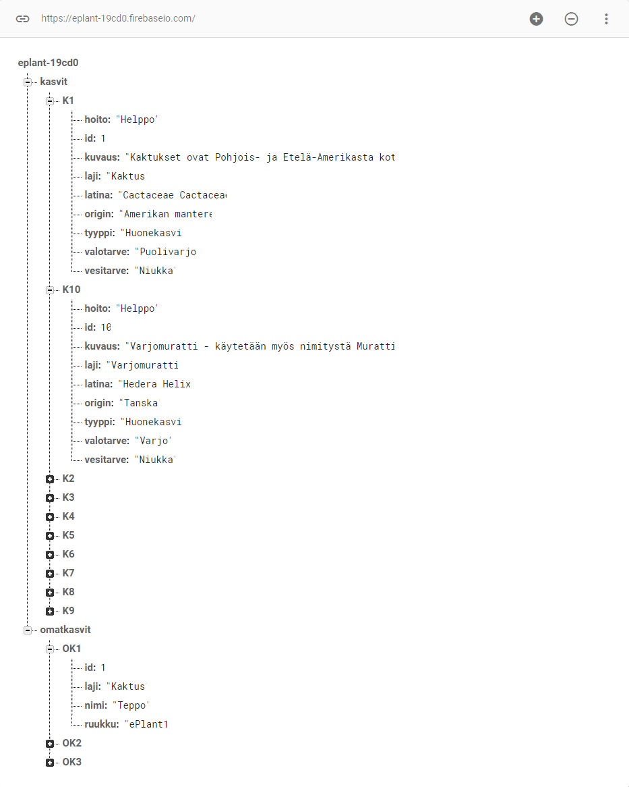
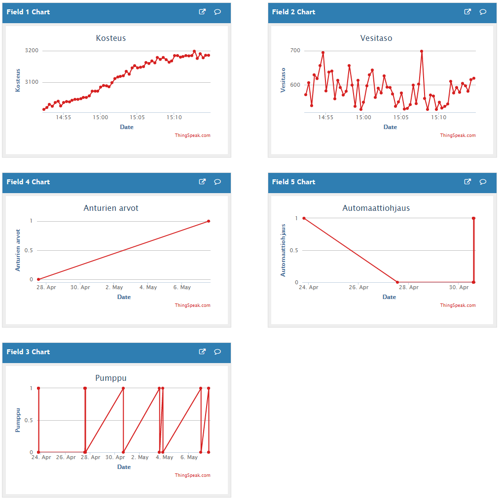
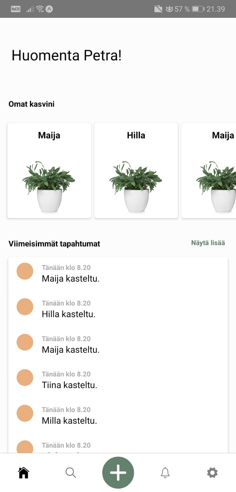
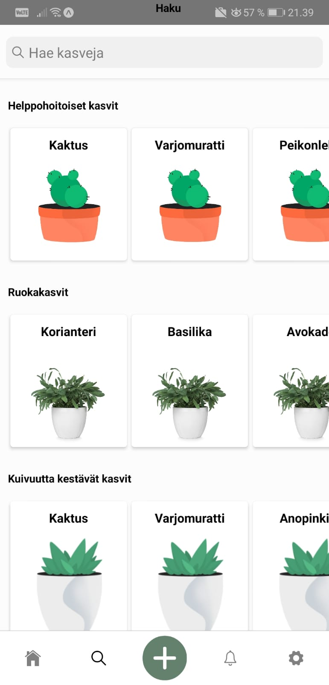
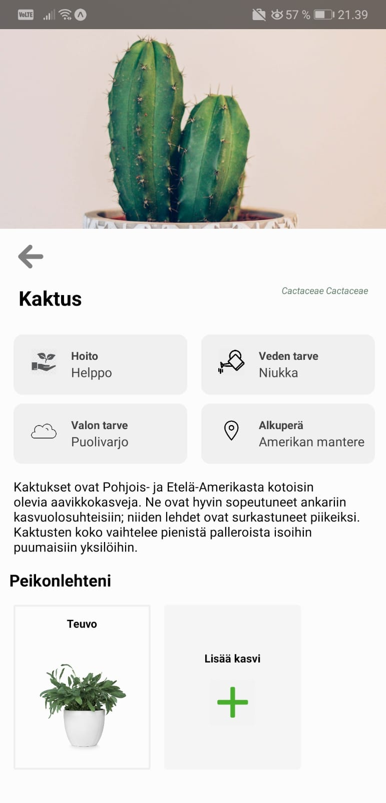

<!-- PROJECT SHIELDS -->
<!--
*** I'm using markdown "reference style" links for readability.
*** Reference links are enclosed in brackets [ ] instead of parentheses ( ).
*** See the bottom of this document for the declaration of the reference variables
*** for contributors-url, forks-url, etc. This is an optional, concise syntax you may use.
*** https://www.markdownguide.org/basic-syntax/#reference-style-links
-->
[![Contributors][contributors-shield]][contributors-url]
[![Forks][forks-shield]][forks-url]
[![Stargazers][stars-shield]][stars-url]
[![Issues][issues-shield]][issues-url]


<!-- PROJECT LOGO -->
<br />
<p align="center">

 <a href="https://github.com/petrapylkki/ePlant/tree/master">
    
  </a>


  <h3 align="center">ePlant</h3>

  <p align="center">
    An automated pot for home plants
    <br />
    <a href="https://github.com/petrapylkki/ePlant/tree/master/frontend"><strong>Explore the docs »</strong></a>
    <br />
    <br />
  <!--  <a href="https://github.com/othneildrew/Best-README-Template">View Demo</a>
    ·
    <a href="https://github.com/othneildrew/Best-README-Template/issues">Report Bug</a>
    ·
    <a href="https://github.com/othneildrew/Best-README-Template/issues">Request Feature</a> -->
  </p>
</p>


<!-- TABLE OF CONTENTS -->
## Table of Contents

* [About the Project](#about-the-project)
  * [Branch Naming](#branch-naming)
  * [Built With](#built-with)
* [Getting Started](#getting-started)
  * [Prerequisites](#prerequisites)
  * [Installation](#installation)
* [Usage](#usage)
* [Roadmap](#roadmap)
* [License](#license)
* [Acknowledgements](#acknowledgements)


<!-- ABOUT THE PROJECT -->
## About The Project

<!-- [![Product Name Screen Shot][product-screenshot]](https://example.com) -->

This projects purpose is to ease people's everyday lives and to help them keep their plants alive.

The aim of the project was to create an automatized pot that has been programmed to answer the specific needs of a certain plant.

The controlling of the smart pot happens with a mobile application that we have developed.


### Branch Naming
* `wip - Works in progress; stuff I know won't be finished soon`
* `feat - Feature I'm adding or expanding`
* `bug - Bug fix or experiment`

	> Naming examples:<br>
	> feat/searching<br>
	> bug/navigation


### Built With

* [React Native](https://reactnative.dev/)
* [C++](https://www.cplusplus.com/)
* [ESP32](https://www.espressif.com/en/products/socs/esp32/overview)


### Enviroments
* [ThingSpeak](https://thingspeak.com/)
* [Firebase](https://firebase.google.com/)


<!-- GETTING STARTED -->
## Getting Started

To get a local copy up and running follow these simple example steps.

### Prerequisites

You will be needing your own ESP32 and also some kind of pot (preferably a 3D-printed, we used this [guide](https://www.thingiverse.com/thing:3537287)) to create an automatized pot. You'll also need a humidity sensor [humidity sensor](https://www.adafruit.com/product/386), [a water level sensor](https://www.instructables.com/id/How-to-use-a-Water-Level-Sensor-Arduino-Tutorial/) and [a water pump](https://www.adafruit.com/product/1150)


For firebase, push some data to the database. For example we have:
```sh
eplant-19-cd0
	kasvit (plants)
		K1(plant1)
			treatment:
			id:
			description:
			species:
			latin:
			origin:
			type:
			needOfLight:
			needOfWater:
```

<!--FIREBASE PICTURE-->
<p align="center">
<kbd>
 <a href="https://github.com/petrapylkki/ePlant/tree/master">
    
  </a>
</kbd>
</p>

<br>
On ThingSpeak we can see the humidity on chart 1, water level on chart 2, if the pump is on or off on chart 3, sensor values on chart 4 and automatic pilot on chart 5. There is a huge amount of good guides in ThingSpeak on how to do this kind of monitoring, so we're not going into the spesifics here. 
<br><br>

<!--THINGSPEAK PICTURE-->
<p align="center">
<kbd>
 <a href="https://github.com/petrapylkki/ePlant/tree/master">
    
  </a>
<kbd>
</p>

### Installation

1. Clone the repo
```sh
git clone https://github.com/petrapylkki/ePlant.git
```
2. Install NPM packages
```sh
npm install
```
3. Install Expo
```sh
npm install expo-cli --global
```


*For further information about Expo and its usage, please visit [Expo Documentation](https://docs.expo.io/).*


<!-- USAGE EXAMPLES -->
## Usage

Here is some pictures from our front end. We created an mobile app to show us when the plants have been watered and all the necessary information about the plants placed in our automated pots. It has at the moment the basic information of 10 plants, but our goal is to add more plants in the future. 

You can also add your own plant, give it a nickname and pick the automated pot where your plant is planted.


<!--HOME SCREEN PICTURE -->
<p align="center">
<kbd>
 <a href="https://github.com/petrapylkki/ePlant/tree/master">
    
  </a>
</kbd>

<!--SEARCH PICTURE -->
<kbd>
 <a href="https://github.com/petrapylkki/ePlant/tree/master">
    
  </a>
</kbd
	
<br>
<br>
<br>

<!--ADD PLANT PICTURE -->
<kbd>
<a href="https://github.com/petrapylkki/ePlant/tree/master">
    
  </a>
</kbd>

<!--SEARCH PICTURE -->
<kbd>
 <a href="https://github.com/petrapylkki/ePlant/tree/master">
    
  </a>
</kbd>
</p>


<!-- ROADMAP -->
## Roadmap

See the [open issues](https://github.com/petrapylkki/ePlant/issues) for a list of proposed features (and known issues).

Any contributions you make are **greatly appreciated**.

1. Fork the Project
2. Create your Feature Branch (`git checkout -b feat/NewFeature`)
3. Commit your Changes (`git commit -m 'Add some NewFeature'`)
4. Push to the Branch (`git push origin feat/NewFeature`)
5. Open a Pull Request


<!-- LICENSE -->
## License

The content of this project itself is licensed under the Creative Commons Attribution 4.0 Unported license [Creative Commons Attribution 4.0 license](https://creativecommons.org/licenses/by/4.0/legalcode), and the MIT license.


MIT License

Copyright (c) [2020] [Jaakko Kammonen]

Permission is hereby granted, free of charge, to any person obtaining a copy
of this software and associated documentation files (the "Software"), to deal
in the Software without restriction, including without limitation the rights
to use, copy, modify, merge, publish, distribute, sublicense, and/or sell
copies of the Software, and to permit persons to whom the Software is
furnished to do so, subject to the following conditions:

The above copyright notice and this permission notice shall be included in all
copies or substantial portions of the Software.

THE SOFTWARE IS PROVIDED "AS IS", WITHOUT WARRANTY OF ANY KIND, EXPRESS OR
IMPLIED, INCLUDING BUT NOT LIMITED TO THE WARRANTIES OF MERCHANTABILITY,
FITNESS FOR A PARTICULAR PURPOSE AND NONINFRINGEMENT. IN NO EVENT SHALL THE
AUTHORS OR COPYRIGHT HOLDERS BE LIABLE FOR ANY CLAIM, DAMAGES OR OTHER
LIABILITY, WHETHER IN AN ACTION OF CONTRACT, TORT OR OTHERWISE, ARISING FROM,
OUT OF OR IN CONNECTION WITH THE SOFTWARE OR THE USE OR OTHER DEALINGS IN THE
SOFTWARE.


<!-- ACKNOWLEDGEMENTS -->
## Acknowledgements

* [Choose an Open Source License](https://choosealicense.com)
* [README Template](https://github.com/othneildrew/Best-README-Template)


<!-- MARKDOWN LINKS & IMAGES -->
<!-- https://www.markdownguide.org/basic-syntax/#reference-style-links -->
[contributors-shield]: https://img.shields.io/github/contributors/petrapylkki/ePlant.svg?style=flat-square
[contributors-url]: https://github.com/petrapylkki/ePlant/graphs/contributors
[forks-shield]: https://img.shields.io/github/forks/petrapylkki/ePlant.svg?style=flat-square
[forks-url]: https://github.com/petrapylkki/ePlant/network/members
[stars-shield]: https://img.shields.io/github/stars/petrapylkki/ePlant.svg?style=flat-square
[stars-url]: https://github.com/petrapylkki/ePlant/stargazers
[issues-shield]: https://img.shields.io/github/issues/petrapylkki/ePlant.svg?style=flat-square
[issues-url]: https://github.com/petrapylkki/ePlant/issues
[license-shield]: https://img.shields.io/github/license/petrapylkki/ePlant.svg?style=flat-square
[license-url]: https://github.com/petrapylkki/ePlant/blob/master/LICENSE.txt
[linkedin-shield]: https://img.shields.io/badge/-LinkedIn-black.svg?style=flat-square&logo=linkedin&colorB=555
[linkedin-url]: https://linkedin.com/in/petrapylkki
[product-screenshot]: images/screenshot.png
